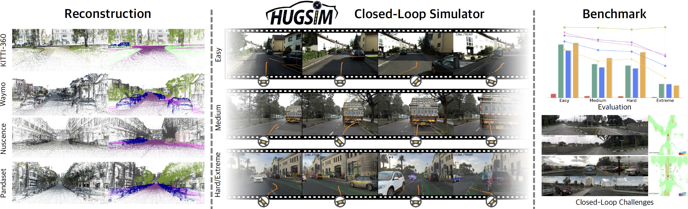

<a id="readme-top"></a>

<!-- PROJECT LOGO -->
<div align="center">
  
  
  <p>
    <a href="https://xdimlab.github.io/HUGSIM/">
      
    </a>
    <a href="https://arxiv.org/abs/2412.01718">
      
    </a>
  </p>
  
  > Hongyu Zhou<sup>1</sup>, Longzhong Lin<sup>1</sup>, Jiabao Wang<sup>1</sup>, Yichong Lu<sup>1</sup>, Dongfeng Bai<sup>2</sup>, Bingbing Liu<sup>2</sup>, Yue Wang<sup>1</sup>, Andreas Geiger<sup>3,4</sup>, Yiyi Liao<sup>1,†</sup> <br>
  > <sup>1</sup> Zhejiang University <sup>2</sup> Huawei <sup>3</sup> University of Tübingen <sup>4</sup> Tübingen AI Center <br>
  > <sup>†</sup> Corresponding Authors

  

  <br>

  <p align="left">
    This is the official project repository of the paper <b>HUGSIM: A Real-Time, Photo-Realistic and Closed-Loop Simulator for Autonomous Driving</b>.
  </p>
  
</div>

---

# TODO list
- [x] Release sample data and results
- [ ] Release unicycle model part
- [ ] Release GUI
- [ ] Release more scenarios

# Installation

Requirements are not in principle hard requirements, but there might be some differences (not tested):
 - Linux
 - Python 3.11
 - CUDA 11.8
 - colmap 3.10-dev
 - Pytorch 2.5.1 / Pytorch 2.2.0
  
Create conda environment needed to run HUGSIM with:
``` bash
conda create --name hugsim python=3.11
```

Please install these packages following official instructions
 - [Pytorch](https://pytorch.org/)
 - [simple_waymo_open_dataset_reader](https://github.com/gdlg/simple-waymo-open-dataset-reader)
 - [tinycudann](https://github.com/NVlabs/tiny-cuda-nn)
 - [unidepth](https://github.com/lpiccinelli-eth/UniDepth)
 - [flow_vis_torch](https://github.com/ChristophReich1996/Optical-Flow-Visualization-PyTorch)
 - [pytorch3d](https://github.com/facebookresearch/pytorch3d/blob/main/INSTALL.md)
 - [kitti360Scripts](https://github.com/autonomousvision/kitti360Scripts)
 - [nuscenes-devkit](https://github.com/nutonomy/nuscenes-devkit) (have to install from the source code for python 3.11)
 - [HUGSIM_splat](https://github.com/hyzhou404/HUGSIM_splat)

Please install packages required by [InverseForm](https://github.com/Qualcomm-AI-research/InverseForm/blob/main/docker/Dockerfile)

Install remaining dependencies by:
``` bash
pip install -r requirements.txt
```

To run the closed-loop simulation, the hug_sim Gymnasium environment should be installed:
``` bash
cd ./sim
pip install -e .
```

# Data Preparation

Please refer to [Data Preparation Document](data/README.md)

You can download sample data from [here](https://huggingface.co/datasets/hyzhou404/HUGSIM/resolve/main/sample_data.zip), which includes a sample sequence, results of the sequence reconstruction, and results of 3dRealCar vehicles reconstruction.

# Reconstruction

``` bash
seq=${seq_name}
input_path=${datadir}/${seq}
output_path=${modeldir}/${seq}
mkdir -p ${output_path}
CUDA_VISIBLE_DEVICES=4 \
python -u train_ground.py --data_cfg ./configs/${dataset_name: [kitti360, waymo, nusc, pandaset]}.yaml \
        --source_path ${input_path} --model_path ${output_path}
CUDA_VISIBLE_DEVICES=4 \
python -u train.py --data_cfg ./configs/${dataset_name}.yaml \
        --source_path ${input_path} --model_path ${output_path}
```

# Simulation

**Before simulation, [UniAD_SIM](https://github.com/hyzhou404/UniAD_SIM), [VAD_SIM](https://github.com/hyzhou404/VAD_SIM) and [NAVSIM](https://github.com/hyzhou404/NAVSIM) client should be installed.**

In **closed_loop.py**, we automatically launch autonomous driving algorithms. In practice, you may encounter errors due to an incorrect environment, path, and etc. For debugging purposes, you can modify the last part of code as:
```python
# process = launch(ad_path, args.ad_cuda, output)
# try:
#     create_gym_env(cfg, output)
#     check_alive(process)
# except Exception as e:
#     print(e)
#     process.kill()

# For debug
create_gym_env(cfg, output)
```

Paths in **configs/sim/\*\_base.yaml** should be updated as paths on your machine.


``` bash
CUDA_VISIBLE_DEVICES=${sim_cuda} \
python closed_loop.py --scenario_path ${scenario_cfg_path} \
            --base_path ./configs/sim/${dataset_name}_base.yaml \
            --camera_path ./configs/sim/${dataset_name}_camera.yaml \
            --kinematic_path ./configs/sim/kinematic.yaml \
            --ad ${method_name: [uniad, vad, ltf]} \
            --ad_cuda ${ad_cuda}
```

Run the following commands to execute the provided examples.

```bash
sim_cuda=0
ad_cuda=1
scenario_dir=./configs/benchmark/nuscenes
for cfg in ${scenario_dir}/*.yaml; do
    echo ${cfg}
    CUDA_VISIBLE_DEVICES=${sim_cuda} \
    python closed_loop.py --scenario_path ${cfg} \
                        --base_path ./configs/sim/nuscenes_base.yaml \
                        --camera_path ./configs/sim/nuscenes_camera.yaml \
                        --kinematic_path ./configs/sim/kinematic.yaml \
                        --ad uniad \
                        --ad_cuda ${ad_cuda}
done
```


# Citation

If you find our paper and codes useful, please kindly cite us via:

```bibtex
@article{zhou2024hugsim,
  title={HUGSIM: A Real-Time, Photo-Realistic and Closed-Loop Simulator for Autonomous Driving},
  author={Zhou, Hongyu and Lin, Longzhong and Wang, Jiabao and Lu, Yichong and Bai, Dongfeng and Liu, Bingbing and Wang, Yue and Geiger, Andreas and Liao, Yiyi},
  journal={arXiv preprint arXiv:2412.01718},
  year={2024}
}
```